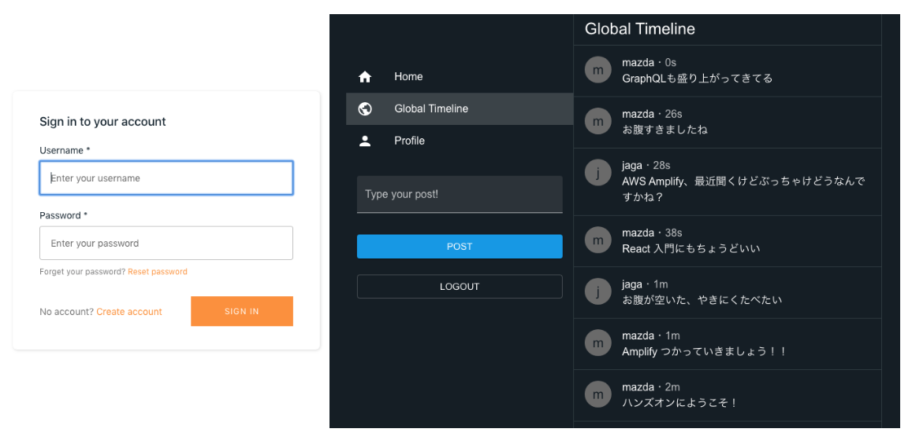

+++
title = "Amplify SNS Workshop"
date = 2020-03-18T10:09:42+09:00
weight = 1
+++

Amplify SNS Workshop へようこそ！本ワークショップでは Twitter ライクなソーシャルメディアアプリケーションの開発を通して、実践的に AWS Amplify について学ぶことが出来ます。

## 対象者
- 爆速で開発したいアプリ開発者
- フロントエンド開発に入門したいサーバーサイドエンジニア

## ワークショップ全体像 
本ワークショップは、スタートアップの調達ステージ別(シード/アーリー/ミドル/レイターなど)のシチュエーションを想定し進めていきます。
本ハンズオンでは以下イメージのようなアプリケーションが出来上がります。

### Stage 1 - シードステージ(第1章 ~ 第4章)
#### スタートアップ１人目のエンジニア/CTOとして、アプリを開発する！
あなたはスタートアップ１人目の開発者です。CEOと相談をしソーシャルメディアアプリケーションを開発することが決まりましたが、投資家への説明（Pitch/DemoDay）まではあと３日しかありません。必要最低限の機能でいいものの、最速での立ち上げが求められています。

#### 学習できること
Amplifyの基礎的な使い方に慣れつつ、ユーザ認証機能や GraphQL を用いたタイムラインの実装、Amplify Mocking の使い方を学びます。また、Amplify が最速でアプリケーションを実装できるだけでなく、将来的なスケーラビリティまでサポートすることを理解します。

### Stage 2 - アーリーステージ(第5章 ~ 第6章)
#### ユーザを一定数獲得し、増え始めた課題や機能要望に対応する！

ひとまず最低限の機能を実装しリリースし、一定数のユーザを獲得することに成功しました。Amplify で構築したためサーバの運用は不要なものの、止むを得ずフロントエンドで行っていたバリデーションの修正や、検索性の向上など、明確になってきた課題や機能要望に答える必要があります。

#### 学習できること
Elasticsearch による高い検索性を GraphQL を利用したアプリケーションに組み込む方法や、GraphQL 利用時にクラウド側で入力規制等を行う方法を学びます。

### Stage 3 - ミドルステージ(第7章 - 第8章)
#### 事業が軌道に乗りユーザもエンジニアも急拡大

機能拡充を続けた結果ビジネスは起動に乗り始め、同時にエンジニア組織も拡大し始めました。並行して複数の機能開発が進むことも増えたため、効率の良いチーム開発について考える必要があります。

#### 学習できること

実際に機能追加を通して、複数の Amplify バックエンド環境を用いるチーム開発や、Amplify Console を用いた機能毎の検証環境の構築について学びます。

## 推奨環境

- 開発環境
  - "Node.js 10.x / npm 6.x" が利用可能な Mac/Windows/Linux
    - 動作環境の確認は v12.16.1/v6.13.4 で行なっています
    - AWS Cloud9 のようなクラウド IDE の場合、Amplify Mocking の際に 20002 番ポートが利用出来ないケースがあるのでご注意ください
- ブラウザ環境
  - Google Chrome (most recent 2 versions)
  - Mozilla Firefox (most recent 2 versions)
  - Internet Explorer v11
  - Microsoft Edge (most recent 2 versions)